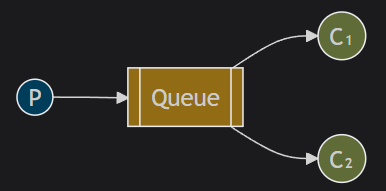
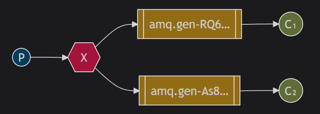
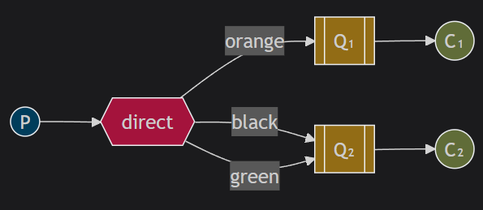
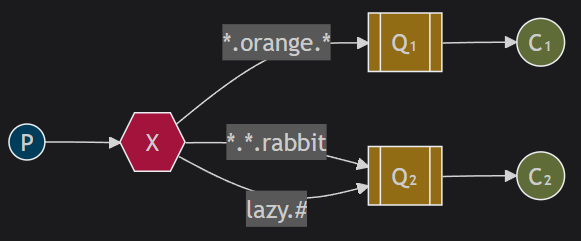
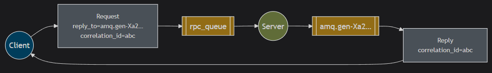

RabbitMQ 是一个消息代理（message broker）：它接受并转发消息。

- Producing 发送消息的程序是一个生产者。
- Queue 消息流都存储在队列中，本质上是一个巨大的消息缓冲区
- Consuming 接收消息的程序是一个消费者。

## Run RabbitMQ

1. Pull RabbitMQ image

```shell
docker pull library/rabbitmq
docker tag library/rabbitmq rabbitmq
```

2. Run RabbitMQ

```shell
docker compose up
```

## Hello world


## Worker queues

- **Message Acknowledgement**: To avoid the message lost when the worker died. Use `d.Ack(false)`.
- **Message Durability**: To avoid the message lost when the server died. Use`durable: true` and `DeliveryMode: amqp.Persistent`.
- **Fair dispatch**: Set prefetchCount `1` mean that RabbitMQ not to give more than one message to a worker at a time.
  ```go
  err = ch.Qos(
    1,  // prefetch count
    0,  // prefetch size
    false,  // global
  )
  ```
  

## Publish/Subscribe

- Temporary queue: it is deleted when the consumer disconnects. Use `""` as queue name and `false` as durable.

- Exchange: it receives messages from producers and it pushes them to queues.

1. **Direct Exchange**

   - **作用**：消息会被路由到与 `routing key` 完全匹配的队列。
   - **使用场景**：适用于需要精确匹配的场景，例如根据消息类型或事件名称进行路由。

2. **Fanout Exchange**

   - **作用**：消息会被广播到所有绑定到该 `exchange` 的队列，忽略 `routing key`。
   - **使用场景**：适用于需要将消息发送到所有订阅者的场景，例如日志记录系统。

3. **Topic Exchange**

   - **作用**：消息会被路由到与 `routing key` 匹配的队列，支持通配符（`*` 和 `#`）。
     - `*` 匹配一个单词。
     - `#` 匹配零个或多个单词。
   - **使用场景**：适用于需要复杂路由规则的场景，例如根据消息的多个属性进行路由。

4. **Headers Exchange**

   - **作用**：消息会被路由到与消息头匹配的队列，忽略 `routing key`。
   - **使用场景**：适用于需要根据消息头中的属性进行路由的场景。

5. **Default Exchange**
   - **作用**：这是一个默认的 `direct exchange`，每个队列都会自动绑定到这个 `exchange`，绑定的 `routing key` 就是队列的名称。
   - **使用场景**：适用于简单的场景，不需要显式声明 `exchange`。



## Routing

```go
err = ch.QueueBind(
	q.Name, // queue name
	"",     // routing key (empty string means all messages)
	"logs", // exchange
	false,
	nil,
)
```

If producer sends a message to `logs` exchange and the routing key is `black`, the message will be sent to the queue which bing the routing key `black`.



## Topics

Use `.` to split the routing key.
We created three bindings: Q1 is bound with binding key `*.orange.*` and Q2 with `*.*.rabbit` and `lazy.#`.


## RPC

AMQP 协议中的关键属性：

- `persistent`: 将消息标记为持久化（true） 或 非持久化（false）
- `content_type`: 描述编码的类型，比如 application/json
- `reply_to`: 命名一个回调队列。
- `correlation_id`: 用于将 RPC 响应与请求关联起来。



1、客户端启动时，它会创建一个独占对象 callback 队列。
2、对于 RPC 请求，客户端发送 `reply_to` 设置 callback 队列；`correlation_id` 设置请求的唯一标识。
3、请求发送给 rpc_queue 队列。
4、RPC worker 接收到请求执行任务，并使用 `reply_to` 字段的队列将结果返回给客户端，附上原先的 `correlation_id`。
5、客户端在 callback 队列收到结果，并检查 `correlation_id` 是否匹配，如果匹配则将响应返回给应用程序。

## Plugins

```sh
rabbitmq-plugins enable rabbitmq_management
```
